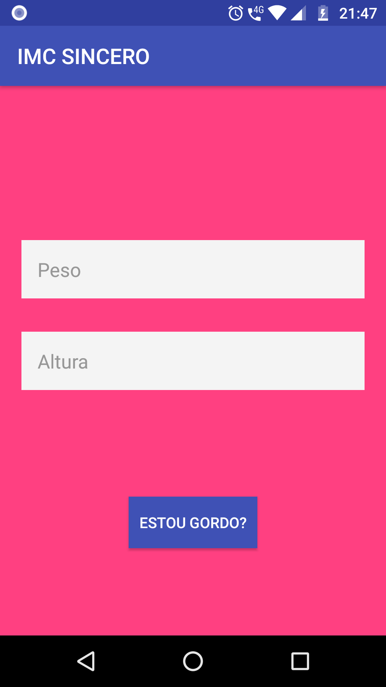
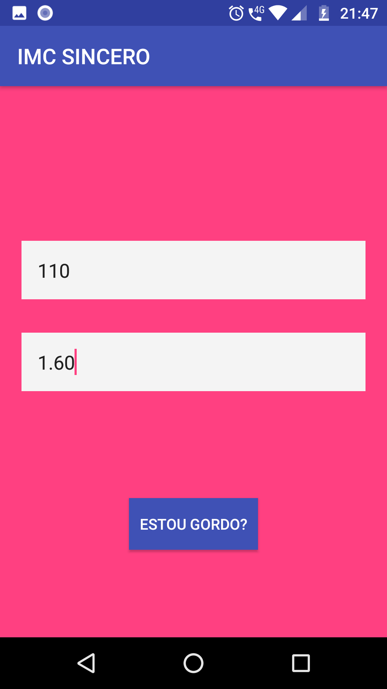

# App Satírico

Fornece respostas absurdas de IMC... 😂😂😂😂

## Getting Started

### Pre-requisitos

```
Ter o android Stúdio instalado na sua máquina.
```

### Instalação

```
git clone https://github.com/marcossaore/app-exercicio-imc
cd app-exercicio-imc
abrir com Android Studio
clicar no ícone de "run"
Só alegria... 😜😜
```

## Authors

* **Marcos Soares** - *App Satírico - [App Satírico](https://github.com/marcossaore/app-exercicio-imc)

## License

This project is open-source

## Telas

<br/>
<br/>
<br/>